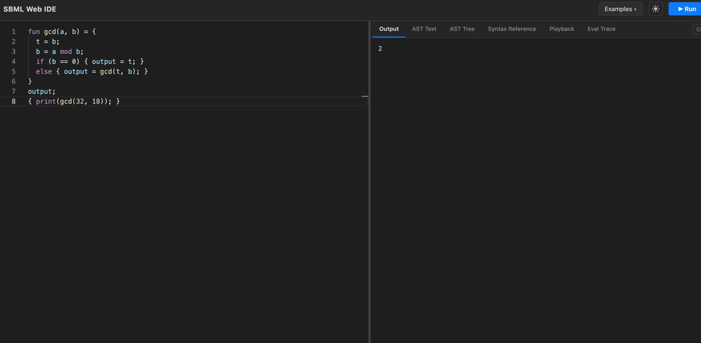
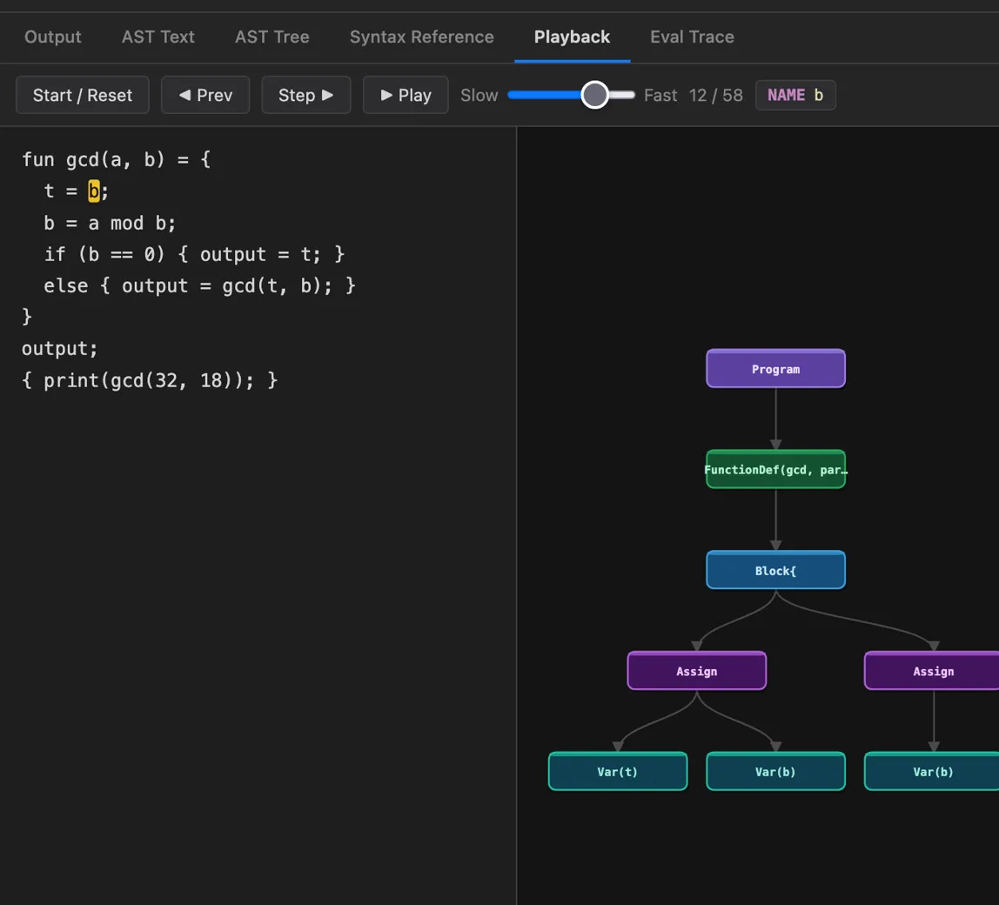
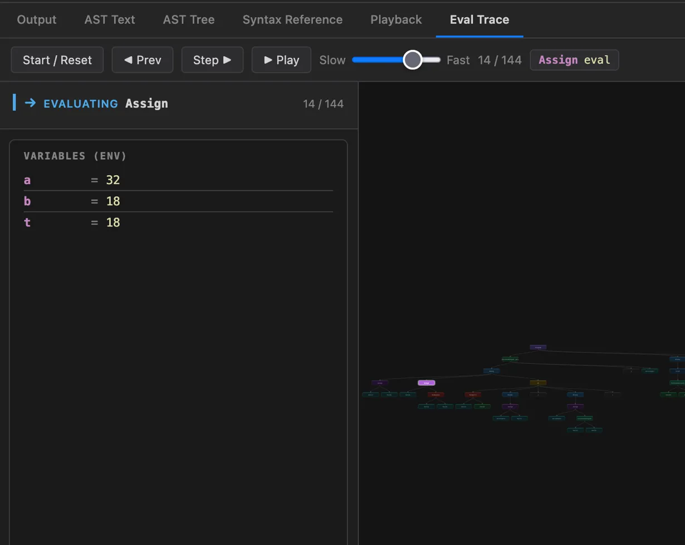

# Code Trace Studio
### Interactive Web IDE for Exploring an Interpreter

Code Trace Studio is an **interactive web IDE for a small block‑structured language (SBML)**.  
Instead of just running programs, it lets you **see exactly how your interpreter works internally**.

You can:

• Run SBML code directly in the browser  
• See terminal‑style program output  
• Inspect the AST as text  
• Visualize the AST as a node graph  
• Watch the AST being constructed token‑by‑token  
• Step through the evaluation of the program tree  

This project turns a traditional interpreter into a **visual learning and debugging environment for programming languages**.

---

# How to Run

## Prerequisites

- Python 3.x with `pip`
- Node.js with `npm`

## 1. Install Python dependencies

```bash
pip install flask flask-cors ply
```

## 2. Start the backend

```bash
python3 server.py
```

The Flask server will start on `http://localhost:5001`.

## 3. Install and start the frontend

```bash
cd frontend
npm install
npm run dev
```

The app will be available at `http://localhost:5173`.

---

# Demo

## IDE Overview



The SBML Web IDE provides a coding environment similar to a lightweight programming IDE.  
Users can write or load SBML programs and run them directly in the browser.

Tabs allow switching between different interpreter views:

• Program Output  
• AST Text  
• AST Tree Visualization  
• Syntax Reference  
• Playback (parser visualization)  
• Evaluation Trace  

---

# Features

## Run SBML Programs

The IDE executes SBML programs and displays output in a terminal‑style console.

Example program computing the GCD:

```sbml
fun gcd(a, b) = {
  t = b;
  b = a mod b;
  if (b == 0) { output = t; }
  else { output = gcd(t, b); }
}
output;
{ print(gcd(32, 18)); }
```

Output:

```
2
```

---

# AST Visualization

## Node Graph Representation



The interpreter builds an **Abstract Syntax Tree (AST)** for every program.

SBML Studio displays this AST as a **visual node graph**, making the program structure easy to understand.

Each node represents:

• Program structure  
• Statements  
• Expressions  
• Variables  
• Operations  

This allows users to **see the structure of a program rather than just reading code**.

---

# Parser Playback

## Step‑by‑Step Tree Construction

One of the most powerful features is **parser playback**.

The IDE can show the AST **being constructed step by step as tokens are scanned**.

Users can:

• Step forward through parsing  
• Step backward  
• Play the parsing animation  
• Control playback speed  

This makes it possible to **observe how the parser converts source code into an AST**.

---

# Evaluation Trace

## Step‑Through Program Execution



The evaluation trace shows **how the interpreter evaluates the AST step by step**.

You can see:

• Current node being evaluated  
• Variable environment values  
• Function calls and recursion  
• Assignment updates  
• Control flow execution  

This effectively turns the interpreter into a **debugger for language execution**.

---

# Language Features

SBML supports a small but expressive set of constructs:

### Variables
```
x = 10;
y = x + 5;
```

### Arithmetic
```
+  -  *  /  mod
```

### Comparisons
```
==  !=  <  <=  >  >=
```

### Conditionals
```
if (x > 5) {
  print(x);
} else {
  print(0);
}
```

### Loops
```
while (x > 0) {
  x = x - 1;
}
```

### Functions
```
fun add(a,b) = {
  output = a + b;
}
```

### Recursion
```
fun fact(n) = {
  if (n == 0) { output = 1; }
  else { output = n * fact(n-1); }
}
```

---

# Architecture

The interpreter consists of several major components.

## Lexer
Tokenizes SBML source code into tokens.

## Parser
Converts tokens into an **Abstract Syntax Tree (AST)**.

## AST Nodes
Represent language constructs like:

• Assignments  
• Expressions  
• Blocks  
• Functions  
• Control flow  

## Evaluator
Traverses the AST and executes the program using an **environment stack for scope management**.

## Visualization Layer
The web IDE renders:

• AST graphs  
• Parsing playback  
• Evaluation traces  

---

# Why This Project Exists

Most interpreters are **black boxes**.  
You give them code and get output.

SBML Studio instead exposes the **entire internal pipeline**:

```
Source Code
      ↓
Tokenization
      ↓
Parsing
      ↓
AST Construction
      ↓
AST Evaluation
      ↓
Program Output
```

The goal is to make interpreters:

• easier to understand  
• easier to debug  
• easier to teach  

---

# Future Improvements

Possible extensions:

• REPL mode  
• Breakpoints during evaluation  
• Better error diagnostics  
• Support for additional data types  
• Improved syntax highlighting  
• Live AST updates while typing  

---

# Author

Built as an enhanced interpreter project exploring:

• programming languages  
• compiler/interpreter design  
• program visualization  
• educational developer tools
